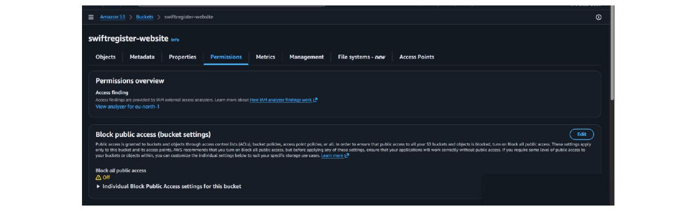
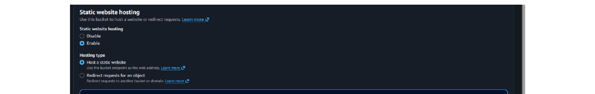
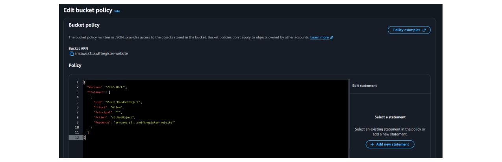
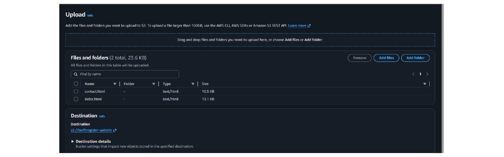
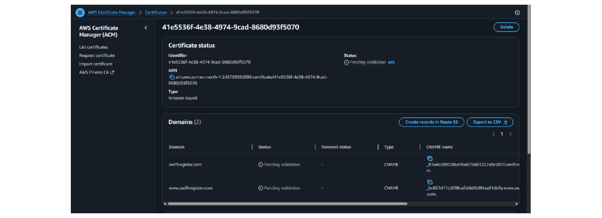
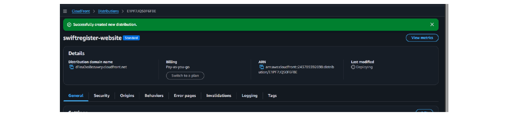

# Hosting a Secure Static Website on AWS

**Stack:** S3 · CloudFront · ACM · Route 53

In this project, I demonstrated how to host a fully functional static website for a company registration agent using AWS. I used Amazon S3 to store the website files, Amazon CloudFront to deliver content securely with HTTPS, AWS Certificate Manager (ACM) to manage the SSL/TLS certificate, and Amazon Route 53 to connect a custom domain name.

I built this project to understand how companies deploy secure, fast, and scalable websites in the cloud — without managing any servers. This is exactly the kind of real-world setup that cloud engineers use every day.

---

## Table of Contents

- [Tools and Concepts](#tools-and-concepts)
- [Architecture / Workflow Diagram](#architecture--workflow-diagram)
- [Project Reflection](#project-reflection)
- [Step-by-Step Explanations](#step-by-step-explanations)
  - [1. Creating and Configuring the S3 Bucket](#1-creating-and-configuring-the-s3-bucket)
  - [2. Adding a Bucket Policy for Public Read Access](#2-adding-a-bucket-policy-for-public-read-access)
  - [3. Uploading the Website Files](#3-uploading-the-website-files)
  - [4. Testing the S3 Website Endpoint](#4-testing-the-s3-website-endpoint)
  - [5. Requesting an SSL Certificate from ACM](#5-requesting-an-ssl-certificate-from-aws-certificate-manager-acm)
  - [6. Creating a CloudFront Distribution](#6-creating-a-cloudfront-distribution)
  - [7. Configuring Route 53 DNS Records](#7-configuring-route-53-dns-records)
  - [8. Verifying HTTPS and Custom Domain](#8-verifying-https-and-custom-domain)
- [Key Concepts Explained Simply](#key-concepts-explained-simply)
- [Testing and Verification](#testing-and-verification)
- [Final Reflections](#final-reflections)

---

## Tools and Concepts

| Service | Role |
|---|---|
| **Amazon S3** (Simple Storage Service) | Store and serve the static website files (HTML, CSS, JS) |
| **S3 Bucket Policy** | A JSON policy that allows public read access to the website files |
| **Amazon CloudFront** | A content delivery network (CDN) that caches the website globally and enables HTTPS |
| **AWS Certificate Manager (ACM)** | Request and validate a free SSL/TLS certificate for the custom domain |
| **Amazon Route 53** | DNS service that connects the custom domain name to the CloudFront distribution |
| **Static Website Hosting on S3** | A feature that turns an S3 bucket into a live website |

This project showed me how AWS services work together to deliver a fast, secure, and professional website — the kind that real companies rely on.

---

## Architecture / Workflow Diagram

The diagram below shows the full request flow — from the moment a visitor opens their browser to the website files being delivered from S3.

```
Visitor
|
| Opens browser and types the website URL
v
DNS Lookup
|
v
Route 53 --> Translates domain name into CloudFront address
|
v
CloudFront --> CDN delivers content from nearest server, enforces HTTPS
|        ^
|        | SSL / TLS Encryption
|        ACM --> Free SSL certificate (padlock icon in browser)
|
v
S3 Bucket --> Stores and serves HTML, CSS, JavaScript files
|
v
Website loads in visitor's browser
```

**Summary:** `Visitor → Route 53 → CloudFront + ACM → S3 Bucket`

---

## Project Reflection

This project took approximately **2 hours** to complete, including:

- Creating and configuring the S3 bucket with static website hosting
- Uploading website files and testing via the S3 endpoint
- Requesting and validating an ACM certificate
- Setting up CloudFront with HTTPS redirection
- Configuring Route 53 DNS records for the custom domain

Testing was also completed on both desktop and mobile devices to ensure the contact form and WhatsApp button worked correctly.

---

## Step-by-Step Explanations

### 1. Creating and Configuring the S3 Bucket

- Created an S3 bucket with a globally unique name.
- Disabled **Block all public access** so the website could be viewed publicly.
- Enabled **Static website hosting** and set the index and error documents to `index.html`.



*Screenshot 1a — S3 Permissions tab — Block all public access showing OFF*



*Screenshot 1b — Static website hosting enabled with index.html set as index and error document*

---

### 2. Adding a Bucket Policy for Public Read Access

- Added a bucket policy in JSON format to grant public read access to all objects inside the bucket.
- The `Resource` field must end with `/*` to apply the policy to all files inside the bucket.

**Bucket Policy Used:**

```json
{
  "Version": "2012-10-17",
  "Statement": [
    {
      "Sid": "PublicReadGetObject",
      "Effect": "Allow",
      "Principal": "*",
      "Action": "s3:GetObject",
      "Resource": "arn:aws:s3:::YOUR_BUCKET_NAME/*"
    }
  ]
}
```

> **Important:** Make sure the `Resource` line ends with `/*` (e.g. `arn:aws:s3:::swiftregister-website/*`) — without the slash, AWS will return a "Policy has invalid resource" error.



*Screenshot 2 — Edit bucket policy — JSON policy saved in the S3 bucket policy editor*

---

### 3. Uploading the Website Files

- `index.html` — Home page
- `contact.html` — Contact page
- `css/styles.css` — Styling
- `js/main.js` — Form behavior
- After uploading, confirmed each file was publicly readable.



*Screenshot 3 — S3 Upload screen — files queued for upload to the swiftregister-website bucket*

---

### 4. Testing the S3 Website Endpoint

- Copied the Bucket website endpoint URL from the S3 Properties tab.
- Opened the URL in a browser — the homepage loaded successfully.
- This confirmed that S3 was correctly serving the website files.

> Screenshot: Browser showing the website loading via the S3 endpoint (http:// — HTTPS comes later with CloudFront).

---

### 5. Requesting an SSL Certificate from AWS Certificate Manager (ACM)

- Requested a public certificate from ACM for the custom domain and its `www` version.
- Chose **DNS validation** — ACM automatically added the validation records to Route 53.
- **Important:** ACM certificates for CloudFront must be requested in the **us-east-1 (N. Virginia)** region.



*Screenshot 5 — ACM certificate showing both domains (swiftregister.com and www.swiftregister.com) with Pending validation status*

---

### 6. Creating a CloudFront Distribution

- **Origin:** S3 bucket website endpoint
- **Viewer protocol policy:** Redirect HTTP to HTTPS
- **Alternate domain names:** custom domain and www version
- **SSL certificate:** the ACM certificate just created
- **Default root object:** `index.html`
- CloudFront took a few minutes to deploy.



*Screenshot 6 — CloudFront distribution successfully created — status showing Deploying*

---

### 7. Configuring Route 53 DNS Records

- Created two **A records** — one for the root domain and one for `www`.
- Both A records point to the CloudFront distribution as an **alias**.

---

### 8. Verifying HTTPS and Custom Domain

- Opened `https://mycustomdomain.com` in browser — website loaded with valid SSL certificate.
- The padlock icon confirmed the connection was secure.
- Tested the contact page and WhatsApp button — everything worked perfectly.


*Screenshot 8 — Final website live at the custom domain — RegPro homepage loading with full navigation and content*

---

## Key Concepts Explained Simply

| Concept | Explanation |
|---|---|
| **S3 Bucket Policy** | A bucket policy is a set of rules written in JSON that controls who can access your S3 bucket. In this project, `"Principal": "*"` was used, which means everyone on the internet can read the files. |
| **CloudFront** | CloudFront caches the website on servers around the world, so visitors load the site from the closest location. It also handles HTTPS automatically — no extra configuration needed. |
| **ACM (AWS Certificate Manager)** | ACM provides free SSL/TLS certificates. When a user visits the website via HTTPS, the certificate proves that the connection is secure and encrypted. |
| **Route 53** | Route 53 is AWS's DNS service. It translates the custom domain name (like swiftregister.com) into the CloudFront distribution's address so browsers can find the website. |

---

## Testing and Verification

| Test | Expected Result | Result |
|---|---|---|
| S3 endpoint loads homepage | Website visible | Pass |
| CloudFront URL loads with HTTPS | Padlock icon appears | Pass |
| Custom domain loads https:// | Secure connection | Pass |
| Contact form opens email client | Email window appears | Pass |
| WhatsApp button opens chat | WhatsApp link works | Pass |

---

## Final Reflections

This project gave hands-on experience with the most common AWS services used for hosting static websites.

**Key skills gained:**

- Combine S3, CloudFront, ACM, and Route 53 into a working solution
- Write and apply an S3 bucket policy for public access
- Enable HTTPS with a free SSL certificate
- Connect a custom domain to a CDN using DNS records

This setup is secure, fast, scalable, and costs very little to run. It is a foundational skill for anyone serious about cloud engineering.

**Next step:** Add a backend contact form using AWS Lambda and API Gateway to make the website fully dynamic.
