# Linux Server Setup on EC2 — Secure Web Server Deployment

**Project:** AWS Cloud Engineering Lab — Project 2  
**Platform:** Amazon Web Services (AWS)  
**Duration:** ~1.5 hours  
**Difficulty:** Beginner–Intermediate

---

## Table of Contents

1. [Project Overview](#project-overview)
2. [Tools & Technologies Used](#tools--technologies-used)
3. [Architecture Summary](#architecture-summary)
4. [Step-by-Step Implementation](#step-by-step-implementation)
   - [Step 1 — Creating an EC2 Security Group](#step-1--creating-an-ec2-security-group)
   - [Step 2 — Creating an IAM Role for EC2](#step-2--creating-an-iam-role-for-ec2)
   - [Step 3 — Creating an EC2 Key Pair](#step-3--creating-an-ec2-key-pair)
   - [Step 4 — Launching the EC2 Instance](#step-4--launching-the-ec2-instance)
   - [Step 5 — Monitoring Instance Startup](#step-5--monitoring-instance-startup)
   - [Step 6 — Accessing the Web Application](#step-6--accessing-the-web-application)
   - [Step 7 — Connecting via Session Manager](#step-7--connecting-via-session-manager)
   - [Step 8 — Monitoring Metrics in CloudWatch](#step-8--monitoring-metrics-in-cloudwatch)
5. [Key Concepts Explained](#key-concepts-explained)
6. [Testing & Verification](#testing--verification)
7. [Resource Cleanup](#resource-cleanup)
8. [Final Reflections](#final-reflections)
9. [Next Steps](#next-steps)

---

## Project Overview

In this project, I launched a secure, hardened Linux web server on AWS EC2. The goal was to understand how real cloud engineers set up production-ready servers with security built in from the start — with no manual configuration after launch. Everything was automated through a startup (user data) script.

**Key activities completed:**

- Configured Security Groups to control inbound and outbound traffic
- Created an IAM Role for secure, credential-free permissions
- Generated an RSA Key Pair for SSH access
- Deployed a Python Flask web application automatically via EC2 User Data
- Used AWS Systems Manager Session Manager for browser-based terminal access
- Monitored server metrics using Amazon CloudWatch

> Total time to complete: approximately 1.5 hours, including resource cleanup.

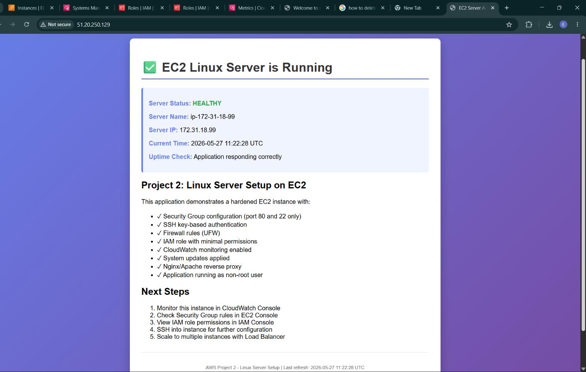
*Figure 1 — Flask web application running on the EC2 instance (Server Status: HEALTHY)*

---

## Tools & Technologies Used

| Service / Tool | Purpose |
|---|---|
| Amazon EC2 | Virtual server running Ubuntu 22.04 LTS in the cloud |
| Security Groups | Virtual firewalls controlling inbound and outbound traffic |
| IAM Roles | Permissions assigned to EC2 instances without long-term credentials |
| Key Pairs | RSA key pairs for secure SSH authentication |
| EC2 User Data | Startup scripts that run automatically on first instance boot |
| AWS Session Manager | Browser-based terminal access — no port 22 required |
| Amazon CloudWatch | Monitoring service for CPU, network, disk, and health metrics |
| Python Flask | Lightweight Python web framework used for the test application |

---

## Architecture Summary

```
Internet
    |
    v
[Security Group]  <-- Allows HTTP (80), HTTPS (443), SSH (22/restricted)
    |
    v
[EC2 Instance: Ubuntu 22.04 LTS / t2.micro]
    |-- IAM Role (Project2-EC2-Role)
    |     |-- CloudWatchAgentServerPolicy
    |     |-- AmazonSSMManagedInstanceCore
    |
    |-- User Data Script (runs on first boot)
    |     |-- System updates
    |     |-- Python + Flask installation
    |     |-- UFW firewall configuration
    |     |-- Nginx reverse proxy setup
    |     |-- Flask app started as non-root user
    |
    |-- Flask Web Application (port 80)
    |-- Nginx Reverse Proxy
    |
    v
[Amazon CloudWatch]  <-- Receives CPU, network, disk, and status metrics
[AWS Systems Manager]  <-- Session Manager terminal access (no port 22 needed)
```

---

## Step-by-Step Implementation

### Step 1 — Creating an EC2 Security Group

A security group acts as a virtual firewall, controlling what traffic is allowed into and out of the server. I created a security group named `project2-web-server-sg` with three inbound rules:

- **SSH (Port 22)** — Secure terminal access, restricted to my IP address only
- **HTTP (Port 80)** — Public web traffic to serve the Flask application
- **HTTPS (Port 443)** — Reserved for future SSL/TLS encryption

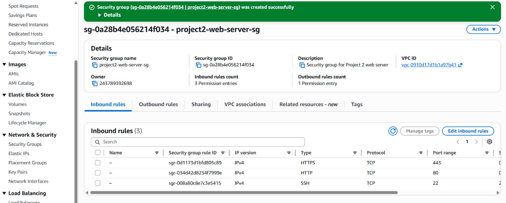
*Figure 2 — Security Group `project2-web-server-sg` with inbound rules for SSH, HTTP, and HTTPS*

---

### Step 2 — Creating an IAM Role for EC2

IAM roles allow EC2 instances to interact with other AWS services securely, without storing long-term access keys on the server. I created a role named `Project2-EC2-Role` and attached two managed policies:

- **CloudWatchAgentServerPolicy** — Allows the server to publish metrics to CloudWatch
- **AmazonSSMManagedInstanceCore** — Enables AWS Systems Manager Session Manager access

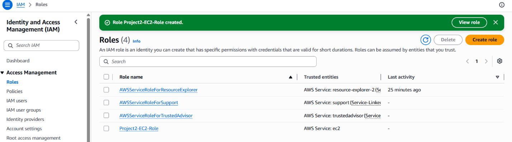
*Figure 3 — IAM Console showing the newly created Project2-EC2-Role*

---

### Step 3 — Creating an EC2 Key Pair

I generated an RSA key pair named `project2-key` in `.pem` format. This key file was saved securely on my local machine and is required for SSH access. Key pairs are a one-time download — AWS does not store the private key.

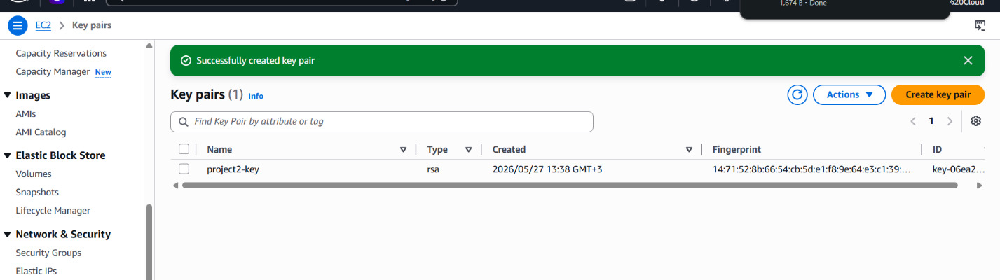
*Figure 4 — Successfully created RSA key pair `project2-key`*

---

### Step 4 — Launching the EC2 Instance

I launched an Ubuntu 22.04 LTS instance using the following configuration:

| Parameter | Value |
|---|---|
| Instance Type | t2.micro (free tier eligible) |
| AMI | Ubuntu 22.04 LTS |
| Key Pair | project2-key |
| Security Group | project2-web-server-sg |
| IAM Role | Project2-EC2-Role |
| Auto-assign Public IP | Enabled |
| Storage | 8 GiB gp2 EBS volume |

In the **Advanced Details** section, I pasted a bash user data script that automatically runs on first boot to install Python, Flask, configure UFW firewall rules, set up a reverse proxy, and start the web application as a non-root user — requiring zero manual configuration after launch.

```bash
#!/bin/bash
# User Data Script for Project 2 - Linux Server Setup on EC2
# This script is executed when EC2 instance is launched
# Copy and paste into EC2 Launch Console -> Advanced Details -> User data

# Update system packages
apt-get update
apt-get upgrade -y

# Install required packages
apt-get install -y \
  curl \
  wget \
  git \
  python3 \
  ...
```

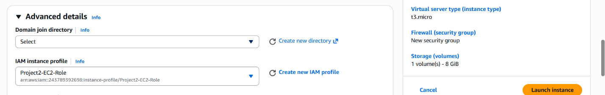
*Figure 5 — User Data script and instance configuration in the EC2 Launch Wizard*

---

### Step 5 — Monitoring Instance Startup

After launching, I waited for the instance to pass its two status checks before considering it ready:

- **Instance reachability check** — Verifies the instance kernel and network are reachable
- **System status check** — Verifies the underlying AWS host hardware and networking

Both checks must display `2/2 passed`. Once confirmed, I copied the Public IPv4 address from the instance details panel.

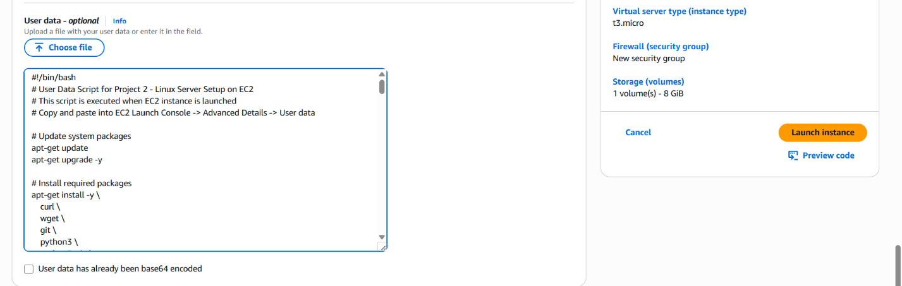
*Figure 6 — EC2 Instances dashboard showing the instance running with 3/3 status checks passed*

---

### Step 6 — Accessing the Web Application

I opened a browser and navigated to `http://<PUBLIC_IP>`. The Flask application loaded and displayed a health dashboard showing:

- Server Status: HEALTHY
- Server Name
- Server IP address
- Current UTC time
- Uptime check: Application responding correctly

I also tested the `/health` endpoint via curl to programmatically confirm the application was responding correctly.

```bash
curl http://<PUBLIC_IP>/health
```

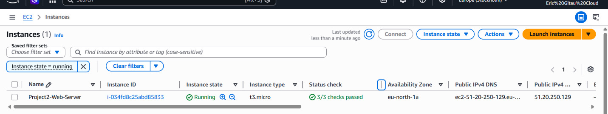
*Figure 7 — Flask application health dashboard accessible via the public IP*

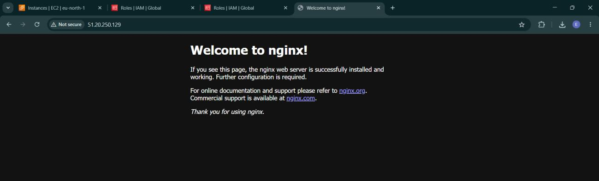
*Figure 8 — Nginx welcome page confirming the reverse proxy is configured correctly*

---

### Step 7 — Connecting via Session Manager

Rather than using traditional SSH with a key file, I connected to the instance through **AWS Systems Manager Session Manager**. This is significantly more secure because it does not require port 22 to be open to the internet. Access is handled entirely through the AWS Console and IAM permissions.

**Steps taken:**

```
EC2 Console → Select instance → Connect → Session Manager → Connect
```

A fully functional terminal opened in the browser.

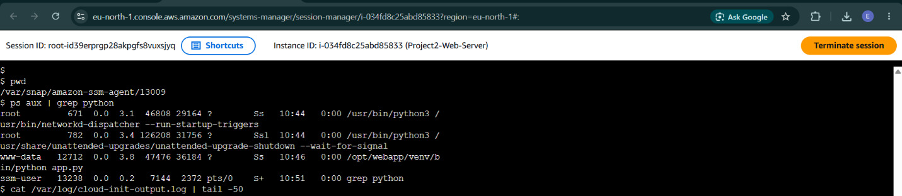
*Figure 9 — AWS Session Manager browser terminal showing Python processes and cloud-init logs*

---

### Step 8 — Monitoring Metrics in CloudWatch

I opened the CloudWatch Console and navigated to **Metrics** → **EC2** to review real-time performance data for the instance. The following metrics were monitored:

- CPU Utilization
- Network In / Out
- Disk Read / Write
- Status Check Failures

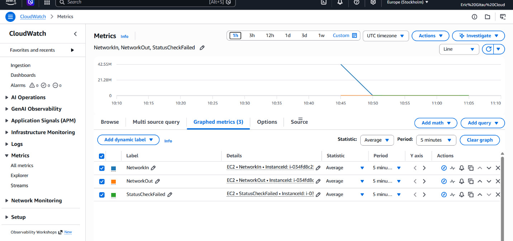
*Figure 10 — CloudWatch Metrics dashboard showing NetworkIn, NetworkOut, and StatusCheckFailed*

---

## Key Concepts Explained

### Security Group

Think of a security group as a bouncer at the door. It inspects every incoming request and only grants access to traffic you explicitly approved — such as web traffic on port 80 or SSH on port 22. All other traffic is denied by default.

### IAM Role for EC2

Normally, granting an application AWS permissions would involve storing an access key and secret on the server — a security risk. IAM roles eliminate this by providing temporary, automatically rotated credentials that AWS manages behind the scenes. No credentials are stored on the instance.

### EC2 User Data

User data is a shell script that runs exactly once — the very first time an EC2 instance boots. It is the mechanism for fully automating server setup: installing packages, configuring services, and starting applications — all without any manual SSH login.

### Session Manager

Session Manager provides a secure, browser-based terminal via the AWS Console. It communicates through the SSM Agent installed on the instance and the IAM role, eliminating the need to open port 22 or manage SSH keys for day-to-day access.

### Amazon CloudWatch

CloudWatch is AWS's native monitoring and observability service. It collects metrics like CPU utilization, network throughput, and disk I/O at regular intervals, enabling you to track server health, set alarms, and investigate performance issues.

---

## Testing & Verification

| Test | Action | Expected Result | Outcome |
|---|---|---|---|
| Web app loads | Open `http://<PUBLIC_IP>` | HEALTHY page displays | Pass |
| Health endpoint | `curl http://<IP>/health` | Returns 'healthy' JSON | Pass |
| Session Manager | EC2 Console → Connect → Session Manager | Browser terminal opens | Pass |
| Security group rules | Review EC2 inbound rules | SSH, HTTP, HTTPS allowed | Pass |
| CloudWatch metrics | View in CloudWatch Console | Data points visible | Pass |
| User data script | Check `/var/log/cloud-init-output.log` | No errors in log | Pass |

---

## Resource Cleanup

Cleaning up resources after a project is an essential cloud discipline — unused resources incur ongoing charges. The following resources were deleted after the project was completed:

1. Terminated the EC2 instance
2. Deleted the Security Group (`project2-web-server-sg`)
3. Deleted the Key Pair (`project2-key`)
4. Deleted the IAM Role (`Project2-EC2-Role`)

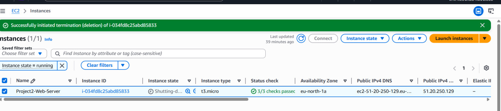
*Figure 11 — EC2 Instances dashboard confirming successful instance termination*

---

## Final Reflections

This project provided hands-on experience with the most common EC2 deployment pattern used by professional cloud and DevOps teams. The combination of security groups, IAM roles, automated user data scripts, and Session Manager represents industry-standard practice for launching production-grade Linux servers on AWS.

**What I learned:**

- Launching a secure Linux server without exposing unnecessary ports
- Assigning permissions to an EC2 instance using IAM roles — no stored credentials
- Automating full server configuration with user data scripts at boot time
- Connecting to a server securely using Session Manager instead of direct SSH
- Monitoring server health in real time with Amazon CloudWatch
- Practising proper cloud cost hygiene through disciplined resource cleanup

> This is a foundational skill for any cloud engineer or DevOps role. Security groups, IAM roles, and automation are non-negotiable in production environments.

---

## Next Steps

1. Add an **Application Load Balancer (ALB)** for high availability
2. Configure an **Auto Scaling Group** to handle variable traffic
3. Attach an **Elastic IP** for a stable, persistent public address
4. Set up **HTTPS with ACM** (AWS Certificate Manager) for SSL/TLS
5. Implement **CloudWatch Alarms** for automated alerting on threshold breaches

---

*AWS Cloud Engineering Lab — Project 2 | Linux Server Setup on EC2*
