# Serverless Contact Form on AWS

**AWS Lambda | API Gateway | Amazon SES**

| Attribute | Detail |
|---|---|
| **Prepared by** | Eric Ngaruiya Gitau |
| **Date** | June 2026 |
| **Project** | Project 3 – Serverless Architecture |
| **Region** | AWS US East (N. Virginia) – us-east-1 |
| **Duration** | Approximately 2 hours |
| **Status** | Completed Successfully |
| **AWS Services Used** | AWS Lambda · Amazon API Gateway · Amazon SES · AWS IAM · Amazon CloudWatch |

---

## Table of Contents

- [1. Executive Summary](#1-executive-summary)
- [2. Project Objectives](#2-project-objectives)
- [3. Architecture Overview](#3-architecture-overview)
- [4. Implementation Steps](#4-implementation-steps)
  - [4.1 Verifying Email Identity in Amazon SES](#41-verifying-email-identity-in-amazon-ses)
  - [4.2 Creating the IAM Role for Lambda](#42-creating-the-iam-role-for-lambda)
  - [4.3 Deploying the Lambda Function](#43-deploying-the-lambda-function)
  - [4.4 Building the API Gateway Endpoint](#44-building-the-api-gateway-endpoint)
  - [4.5 Configuring CORS](#45-configuring-cors)
  - [4.6 Connecting the Frontend](#46-connecting-the-frontend)
  - [4.7 End-to-End Testing](#47-end-to-end-testing)
  - [4.8 Monitoring with Amazon CloudWatch](#48-monitoring-with-amazon-cloudwatch)
- [5. Key Learning Outcomes](#5-key-learning-outcomes)
- [6. Challenges and Solutions](#6-challenges-and-solutions)
- [7. Project Results](#7-project-results)
- [8. Skills Demonstrated](#8-skills-demonstrated)
- [9. Conclusion](#9-conclusion)

---

## 1. Executive Summary

This project demonstrates the design and deployment of a fully serverless contact form system built on Amazon Web Services. The solution allows website visitors to submit messages that are automatically processed and delivered as formatted emails — all without a single server to manage, patch, or scale.

The core problem being solved is one every business faces: how to receive messages from website visitors efficiently and reliably, without the overhead of maintaining backend infrastructure. Traditional approaches require a web server running 24/7. This serverless approach runs only when needed, costs a fraction of the price, and scales automatically from one request to one million.

| Project Attribute | Detail |
|---|---|
| **Problem Solved** | Receiving website contact form submissions without managing servers |
| **Solution Type** | Event-driven serverless architecture on AWS |
| **Core Services** | Lambda, API Gateway, SES, IAM, CloudWatch |
| **Outcome** | Fully functional form with verified email delivery and real-time logging |
| **Total Cost** | Effectively $0 — within AWS Free Tier limits |

> **What is Serverless?**
> Serverless does not mean no servers — it means you never see or manage the servers. AWS provisions, scales, and maintains the underlying infrastructure automatically. You only write code and pay for the exact milliseconds it runs.

---

## 2. Project Objectives

This project was designed to achieve the following practical outcomes:

- Deploy a Node.js Lambda function that receives and processes HTTP form data
- Create a public-facing REST API using Amazon API Gateway
- Configure Amazon SES to send formatted emails programmatically
- Apply AWS IAM least-privilege principles when granting permissions to Lambda
- Implement CORS to allow cross-origin browser requests to the API
- Store configuration values securely using Lambda environment variables
- Validate the complete system through multiple testing methods
- Monitor function execution and troubleshoot using Amazon CloudWatch Logs
- Practice responsible cloud use by cleaning up all resources after testing

---

## 3. Architecture Overview

The architecture follows a standard event-driven serverless pattern. Each component has a single, well-defined responsibility, and they communicate over standard HTTP.

> **How the Services Connect**
> A user submits the HTML form → the browser sends a POST request to API Gateway → API Gateway forwards it to the Lambda function → Lambda validates the data and calls SES → SES delivers the email to the recipient inbox. CloudWatch captures logs at every Lambda execution.

```
Browser (contact.html)
        |
        | POST request (JSON payload)
        v
Amazon API Gateway  ──  Public HTTPS endpoint  ──  /contact resource
        |
        | Lambda Proxy Integration
        v
AWS Lambda (ContactFormHandler)
  - Validates name, email, message fields
  - Constructs formatted HTML email body
  - Calls SES SDK to send email
        |
        | ses:SendEmail
        v
Amazon SES  ──  Delivers email to recipient inbox
        |
        v
Amazon CloudWatch  ──  Captures all execution logs
```

| Component | Role in the Architecture |
|---|---|
| **contact.html** | Static frontend form hosted locally. Collects name, email, and message, then sends a JSON POST request to the API endpoint. |
| **Amazon API Gateway** | Provides the public HTTPS endpoint. Routes incoming POST requests on the /contact resource to the Lambda function. Handles CORS preflight OPTIONS requests. |
| **AWS Lambda** | The application logic layer. Receives form data, validates all fields are present, constructs a formatted email, and calls SES to send it. Runs Node.js 24.x on arm64. |
| **AWS IAM Role** | The ContactFormLambdaRole grants Lambda exactly two permissions: write logs to CloudWatch (AWSLambdaBasicExecutionRole) and send emails via SES (SESSendPolicy inline). |
| **Amazon SES** | Handles the actual email delivery. In sandbox mode, both the sender and recipient email addresses must be verified before any emails can be sent. |
| **Amazon CloudWatch** | Automatically captures every Lambda execution log, including request details, processing time, email message IDs, and billed duration. |

---

## 4. Implementation Steps

### 4.1 Verifying Email Identity in Amazon SES

Before Amazon SES can send any emails, the sender address must be verified. This is a security control that prevents the service from being used to send spam from addresses that do not belong to the requester.

The verification process involved navigating to the SES Console in the us-east-1 (N. Virginia) region, creating a new verified identity using an email address, and clicking the confirmation link sent by AWS.

> **SES Sandbox Mode**
> New AWS accounts start in SES sandbox mode. In this mode, emails can only be sent to and from verified addresses. This is ideal for development and testing. Production applications request an exit from sandbox to send to any recipient.

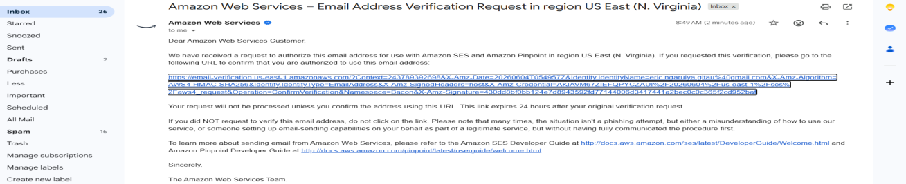

*Figure 1 – AWS verification email received in Gmail inbox, confirming the identity verification request for Amazon SES in the us-east-1 region*

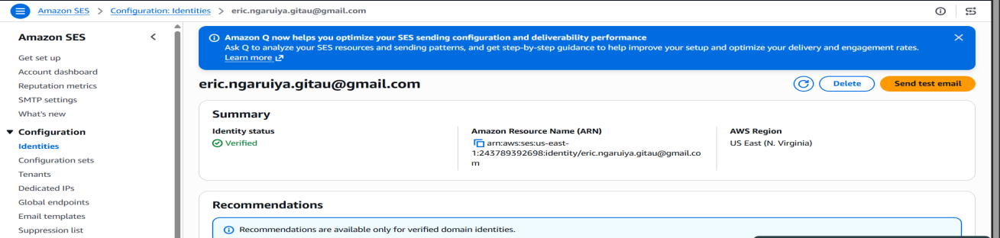

*Figure 2 – Amazon SES Console showing the verified identity for eric.ngaruiya.gitau@gmail.com with a green "Verified" status badge*

---

### 4.2 Creating the IAM Role for Lambda

AWS Lambda functions cannot perform actions in other AWS services without explicit permission. Rather than embedding credentials directly in code — a serious security risk — the best practice is to assign an IAM role to the function.

A role named `ContactFormLambdaRole` was created with the Lambda service as the trusted entity. Two policies were attached:

- **AWSLambdaBasicExecutionRole (AWS Managed)** – Grants Lambda permission to create and write to CloudWatch log groups.
- **SESSendPolicy (Customer Inline)** – A custom policy allowing only `ses:SendEmail` and `ses:SendRawEmail` actions. Nothing more.

> **Principle of Least Privilege**
> Least privilege is a foundational cloud security concept. It means granting only the permissions required to perform a task and nothing beyond that. If the Lambda function were ever compromised, an attacker could only send emails — they could not access S3, databases, or any other service.

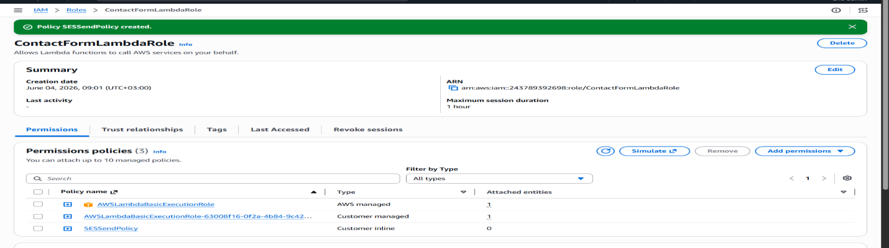

*Figure 3 – IAM Console showing the ContactFormLambdaRole with all three attached policies: AWSLambdaBasicExecutionRole (AWS managed), a customer managed variant, and the custom SESSendPolicy inline policy*

---

### 4.3 Deploying the Lambda Function

A Lambda function named `ContactFormHandler` was created using the Node.js 24.x runtime on arm64 architecture. The `ContactFormLambdaRole` was assigned as the execution role during creation.

The function code (`index.js`) was uploaded as a ZIP archive containing the Node.js handler and `package.json`. The function performs three tasks on each invocation: validates that name, email, and message fields are all present; constructs a formatted HTML email body; and calls the SES SDK to send the email.

To avoid hardcoding email addresses into the source code, two environment variables were configured:

- `SENDER_EMAIL` – the verified SES sender address
- `RECIPIENT_EMAIL` – the inbox where form submissions are delivered

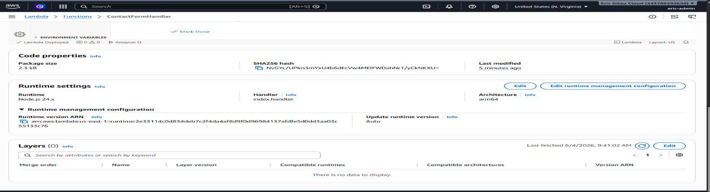

*Figure 4 – Lambda function configuration showing the ContactFormHandler function with Node.js 24.x runtime, arm64 architecture, and code properties confirming successful deployment*

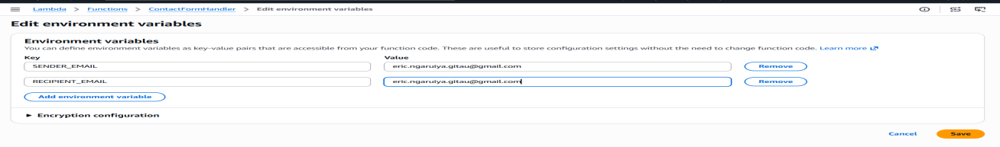

*Figure 5 – Lambda environment variables configuration showing SENDER_EMAIL and RECIPIENT_EMAIL set to the verified Gmail address, keeping credentials out of the source code*

---

### 4.4 Building the API Gateway Endpoint

Amazon API Gateway was used to create a REST API named `ContactFormAPI`. A `/contact` resource was added under the root, and two methods were configured on it:

- **POST** – Integrated with the `ContactFormHandler` Lambda function using Lambda Proxy Integration, which passes the full HTTP request directly to the function.
- **OPTIONS** – A mock integration used to respond to CORS preflight requests from browsers.

After configuration, the API was deployed to a stage named `prod`. The resulting Invoke URL followed the format:

```
https://{api-id}.execute-api.us-east-1.amazonaws.com/prod/contact
```

> **Lambda Proxy Integration**
> With proxy integration enabled, API Gateway passes the entire HTTP request — headers, query string, body, and metadata — directly to Lambda as a JSON event object. The Lambda function is fully responsible for parsing the request and forming a valid HTTP response. This gives the developer complete control over the API behaviour.

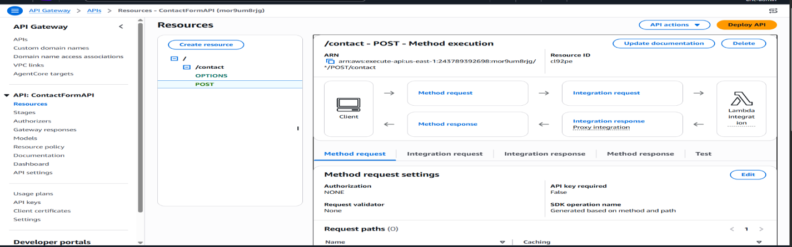

*Figure 6 – API Gateway console showing the ContactFormAPI Resources panel with the /contact resource, OPTIONS and POST methods, and the POST method execution flow diagram confirming Lambda proxy integration*

---

### 4.5 Configuring CORS

CORS (Cross-Origin Resource Sharing) is a browser security mechanism. When a static HTML page on one domain (or opened as a local `file://` URL) attempts to call an API on a different domain, the browser first sends a preflight OPTIONS request to check whether the API permits cross-origin calls.

CORS was enabled on the `/contact` resource, which automatically added the required response headers including `Access-Control-Allow-Origin: *` to the OPTIONS and POST method responses. This instructs the browser to allow form submissions from any origin.

> **Why CORS Matters**
> Without CORS headers, the browser silently blocks the API call and the form appears broken — even though the API itself is fully functional. This is one of the most common issues developers encounter when connecting a frontend to a cloud API for the first time.

---

### 4.6 Connecting the Frontend

The frontend consists of a single HTML file (`contact.html`) with an embedded JavaScript fetch call. To connect the form to the live API, the placeholder URL in the JavaScript was replaced with the actual API Gateway Invoke URL.

The updated endpoint value was set to:

```
https://mor9um8rjg.execute-api.us-east-1.amazonaws.com/prod/contact
```

The JavaScript collects the three form fields, sends them as a JSON payload in a POST request, and displays a success or error banner based on the API response. A loading spinner is shown while the request is in flight.

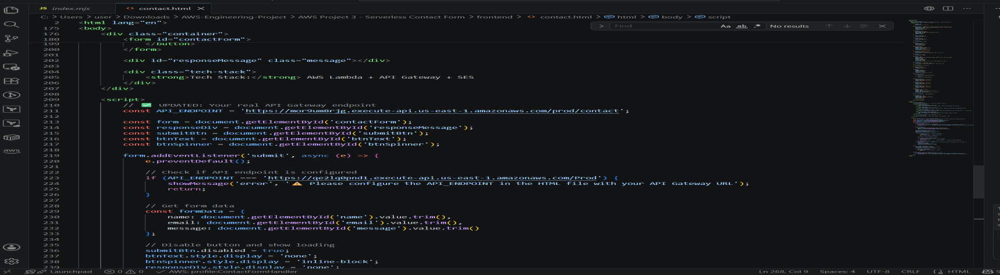

*Figure 7 – VS Code editor showing contact.html with the live API Gateway endpoint URL configured on line 211, replacing the original placeholder value*

---

### 4.7 End-to-End Testing

The complete system was tested using two independent methods to confirm that every component in the chain was functioning correctly.

#### Method 1 – Browser Form Submission

The `contact.html` file was opened directly in Google Chrome. Test data was entered in all three fields and the form was submitted. The button briefly displayed a loading spinner before showing a green success banner confirming the message was sent.

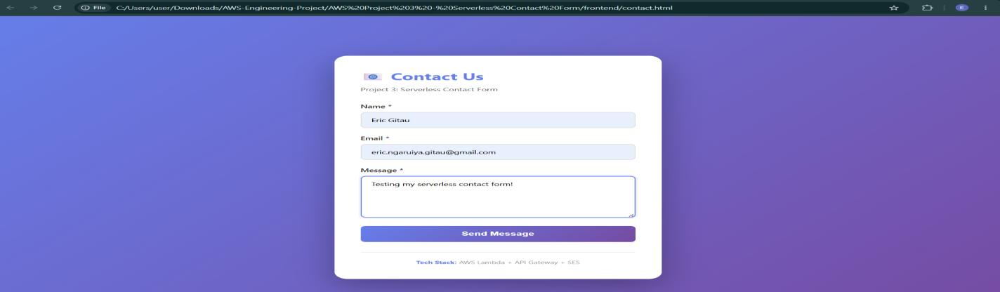

*Figure 8 – Chrome browser showing the live contact form with test data filled in (Name: Eric Gitau, Email, and Message fields) ready for submission*

#### Method 2 – curl Command-Line Test

The API was also tested directly from the terminal using curl, bypassing the browser entirely. This confirmed that the API endpoint and Lambda function were responding correctly independent of any frontend behaviour.

```bash
curl -X POST "https://mor9um8rjg.execute-api.us-east-1.amazonaws.com/prod/contact" \
  -H "Content-Type: application/json" \
  -d '{"name":"Eric Gitau","email":"eric.ngaruiya.gitau@gmail.com","message":"Hello from my serverless project"}'
```

**Successful response:**

```json
{"success":true,"message":"Email sent successfully!","messageId":"0100019e918935b3-7d8b1a-7da7-4abc-bd8b-1b85bcba41589-000000"}
```

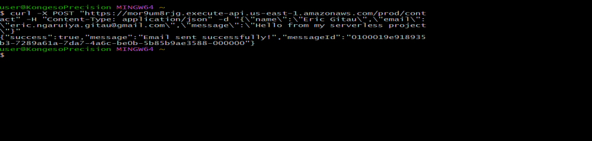

*Figure 9 – Git Bash terminal showing the curl POST request to the API endpoint and the successful JSON response: `{"success":true,"message":"Email sent successfully!"}`*

#### Email Delivery Verification

Following both test submissions, emails were received in the Gmail inbox. The emails were delivered via amazonses.com and contained the formatted contact form data including sender name, email address, timestamp, and message body.

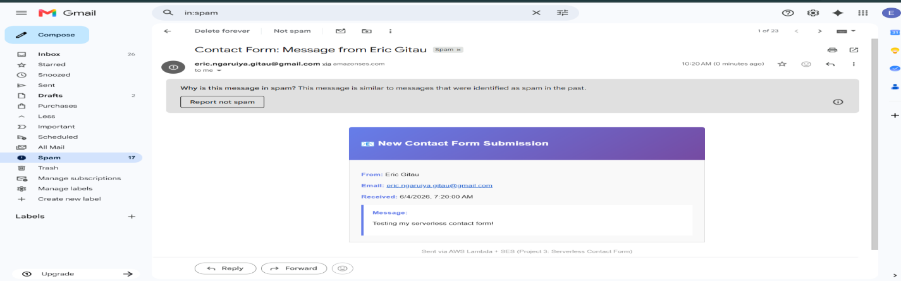

*Figure 10 – Gmail inbox showing the first received contact form email with subject "Contact Form: Message from Eric Gitau", sent via Amazon SES from the Lambda function*

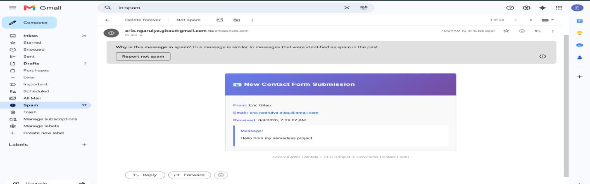

*Figure 11 – Second received email from the curl test, confirming that the API endpoint correctly processes and delivers submissions from both browser and terminal sources*

---

### 4.8 Monitoring with Amazon CloudWatch

AWS Lambda automatically writes structured execution logs to Amazon CloudWatch under the log group `/aws/lambda/ContactFormHandler`. These logs are essential for understanding function behaviour, diagnosing issues, and confirming successful execution.

The log stream reviewed after testing contained the following key entries:

- `INIT_START` – Lambda cold start, runtime initialisation (Node.js 24.x, arm64)
- `START RequestId` – unique identifier for the invocation
- `INFO Received event` – confirms the API request reached Lambda with the correct path and HTTP method
- `INFO Email sent successfully` – SES confirmed delivery with a message ID
- `END RequestId` – function execution completed
- `REPORT` – execution duration (1437ms), billed duration (1798ms), memory usage (101 MB of 128 MB allocated)

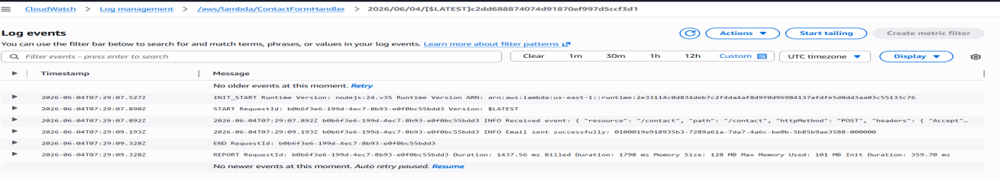

*Figure 12 – Amazon CloudWatch Log Events view for /aws/lambda/ContactFormHandler showing a complete execution cycle from INIT_START through to REPORT, confirming successful email delivery with SES message ID*

> **Reading the REPORT Line**
> The REPORT line is the most useful entry for cost and performance analysis. "Duration" is actual execution time. "Billed Duration" is rounded up to the nearest millisecond. "Init Duration" appears on cold starts only. This function used 101 MB of the 128 MB allocated — indicating efficient memory usage.

---

## 5. Key Learning Outcomes

| Concept | What Was Learned |
|---|---|
| **Serverless Architecture** | Understood the event-driven model where functions are invoked on demand rather than running continuously on servers. |
| **IAM Security** | Applied the principle of least privilege by crafting a minimal IAM role with only the permissions Lambda actually needed. |
| **REST API Design** | Built a REST API with defined resources, HTTP methods, and staged deployments — the same pattern used in enterprise API design. |
| **Email Automation** | Integrated SES to send structured, programmatic emails without any SMTP server configuration. |
| **CORS Troubleshooting** | Understood why browsers block cross-origin requests and how to configure APIs to permit them correctly. |
| **Secure Config Management** | Stored sensitive values in Lambda environment variables rather than hardcoding them into source code. |
| **Observability** | Used CloudWatch to trace a request from HTTP entry through Lambda execution to SES delivery — a complete end-to-end trace. |
| **API Testing** | Validated APIs using both curl (programmatic) and a browser form (user-facing), covering two distinct testing perspectives. |

---

## 6. Challenges and Solutions

| Challenge | How It Was Resolved |
|---|---|
| **curl command failed on Git Bash (Windows)** | The backslash line-continuation character (`\`) is not reliably handled by Git Bash on Windows. The solution was to write the entire curl command on a single line, removing the multi-line format used in Linux terminals. |
| **Exclamation mark broke the curl command** | Git Bash interprets `!` inside double quotes as a history expansion command. The fix was to remove the exclamation mark from the test message string, since Git Bash does not support disabling this behaviour easily. |
| **Emails delivered to spam folder** | Amazon SES in sandbox mode does not have a sender reputation established with email providers. Gmail routed the emails to spam as a precaution. This is expected behaviour in sandbox. In production, SES domain verification and DKIM signing resolve this. |
| **CORS preflight not configured initially** | The first API deployment did not include the OPTIONS method, causing browser requests to fail with a CORS error. Adding CORS during resource creation and redeploying the API resolved this immediately. |

---

## 7. Project Results

All project objectives were met. The serverless contact form system was deployed successfully and verified through multiple testing methods.

| Test Case | Method | Expected Result | Outcome |
|---|---|---|---|
| API Response | curl POST request | JSON with `success: true` | Pass |
| Email Delivery | Check Gmail inbox | Email within seconds | Pass |
| HTML Form Submit | Browser form fill | Success message + email | Pass |
| CloudWatch Logs | View log group | Lambda logs appear | Pass |
| CORS Preflight | Browser DevTools | OPTIONS returns 200 | Pass |
| Validation Check | Submit empty fields | Error response returned | Pass |

The final deployed system is capable of accepting form submissions from any browser, processing them through a serverless backend, and delivering formatted emails within seconds — with zero ongoing infrastructure management required.

---

## 8. Skills Demonstrated

| Skill / Technology | What Was Demonstrated |
|---|---|
| **AWS Lambda** | Serverless function development and deployment |
| **Amazon API Gateway** | REST API design, resources, methods, and staged deployment |
| **Amazon SES** | Programmatic email delivery and identity verification |
| **AWS IAM** | Least-privilege role creation and inline policy management |
| **AWS CloudWatch** | Log group monitoring and real-time log streaming |
| **CORS Configuration** | Cross-origin resource sharing and preflight handling |
| **Node.js (Runtime)** | Serverless backend logic and SDK integration |
| **Environment Variables** | Secure configuration management inside Lambda |
| **API Testing** | End-to-end validation using curl and browser DevTools |
| **Cloud Cost Management** | Resource cleanup and AWS Free Tier awareness |

---

## 9. Conclusion

This project delivered a complete, production-pattern serverless application using five AWS services working in concert. From IAM role configuration to CloudWatch log analysis, every component was built, tested, and verified hands-on.

The most significant takeaway is the practical understanding of how modern companies build backend services without servers. The combination of API Gateway, Lambda, and SES is a pattern seen across thousands of real-world applications — from contact forms to payment webhooks to notification pipelines.

From a cloud engineering perspective, this project demonstrates the ability to:

- Design and deploy event-driven serverless systems
- Implement security best practices using IAM least-privilege roles
- Configure cross-origin communication between frontend and backend services
- Test and validate APIs at both the protocol level (curl) and application level (browser)
- Monitor and interpret cloud function execution logs in CloudWatch

> **Next Steps**
> Future enhancements planned for this project include: adding Google reCAPTCHA to prevent spam bot submissions; integrating Amazon DynamoDB to persist every form submission for record-keeping; implementing Amazon SNS for SMS notifications alongside email; and deploying the frontend to Amazon S3 with a custom domain via Route 53 and an SSL certificate from AWS ACM.

---

**Eric Ngaruiya Gitau**  
Aspiring Cloud & DevOps Engineer | AWS Certified | Kenyatta University  
[github.com/Mide69/AWS-Engineering-Project](https://github.com/Mide69/AWS-Engineering-Project) | Nairobi, Kenya
